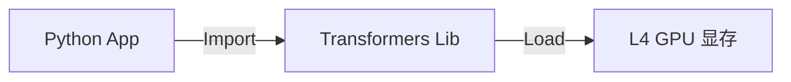
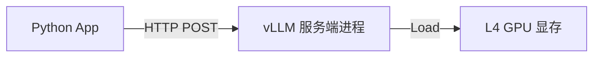

# vLLM 迁移方案：加速 Qwen2-VL 推理

## 1. 执行摘要 (Executive Summary)

**当前瓶颈：**
目前的实现使用了 HuggingFace `transformers` 库配合标准的 Batch（批量）处理。对于 VLM 任务（如 Qwen2-VL），这种方法存在严重的效率问题：
1.  **Padding（填充）浪费**：为了对齐不同长宽比和分辨率的图片生成的 Token，需要大量无效的填充数据。
2.  **伪并行**：现有的 Vision Encoder 实现往往是串行的。
在 L4 GPU 上，这导致了 **"负优化"**：Batch=4 的速度竟然比串行（Batch=1）还要慢。

**解决方案：**
将推理后端迁移到 **vLLM (Versatile Large Language Model)**。vLLM 利用 **PagedAttention** 和 **Continuous Batching (连续批处理)** 技术，允许不同长度的请求同台运行而无需填充。这是目前工业界高吞吐 LLM/VLM 推理的标准方案。

**预期成果：**
- **消除 Padding 浪费：** GPU 只计算有效的 Token。
- **真正的并行：** 多个 Track 可以同时被处理，极大提高 GPU 利用率。
- **速度提升：** 相比当前的串行执行，预期吞吐量提升 2-5 倍。

---

## 2. 架构变更

### From: 库集成模式 (当前)
Python 应用程序直接加载模型权重到 GPU 显存，并在同一个进程内执行推理。



### To: 客户端-服务器模式 (推荐)
vLLM 作为一个独立的高性能 API 服务器（兼容 OpenAI 协议）在本地机器上运行。应用程序通过 HTTP 连接与之通信。



*注：虽然 vLLM 也支持离线的 `LLM` 类直接导入，但 Server 模式在长运行流水线中更健壮，且更容易进行多进程扩展和调试。*

---

## 3. 实施步骤

### 步骤 1: 环境准备
需要安装 `vllm`。鉴于您使用的是 L4 GPU，通常已经具备 CUDA 环境。

```bash
pip install vllm
pip install openai  # 用于与 vLLM 通信的标准客户端
```

### 步骤 2: 更新配置 (`src/core/config.py`)
在配置中增加切换后端（Backend）的选项。

```python
@dataclass
class SystemConfig:
    # ... 现有字段 ...
    
    # 新增后端选项
    vlm_backend: str = "vllm"  # 选项: "hf", "vllm"
    vlm_api_url: str = "http://localhost:8000/v1"
    vlm_model_name: str = "Qwen/Qwen2-VL-7B-Instruct" # vLLM 需要准确的模型仓库 ID
```

### 步骤 3: 创建 VLLM 客户端 (`src/pipeline/vlm_client_vllm.py`)
创建一个新的客户端类，实现与 `Qwen3VL4BHFClient` 相同的接口（`answer`, `compose_final_answer`），但内部使用 `openai` 库来调用 vLLM 服务。

**关键实现细节：**
- **图片处理：** vLLM 接受 URL 或 Base64 格式的图片。对于本地文件，我们将使用 Base64 编码传输。
- **Prompt 结构：** 适配 OpenAI API 的格式（vLLM 会在内部处理具体的模型模板）。

### 步骤 4: 重构 `src/pipeline/recall.py` (或 Router)
更新工厂模式逻辑，根据 `config.vlm_backend` 的值来实例化正确的客户端。

---

## 4. 运行新流水线

### 1. 启动服务器 (终端 1)
只需运行一次。即使 Python 脚本停止，模型依然加载在显存中（避免了每次调试都要重新加载模型的几分钟等待）。

```bash
python -m vllm.entrypoints.openai.api_server \
    --model Qwen/Qwen2-VL-7B-Instruct \
    --trust-remote-code \
    --limit-mm-per-prompt image=5 \  # 允许每条请求最多包含 5 张图
    --gpu-memory-utilization 0.9
```

### 2. 运行您的应用 (终端 2)
```bash
python main.py
```

---

## 5. 当前临时措施 (Immediate Action)

在我们准备这次迁移的同时，**必须先修复当前的性能倒退问题。**

**行动：** 将 `src/core/config.py` 中的 `vlm_batch_size` 改回 `1`。
**原因：** 这能立刻停止 "Padding 惩罚"，恢复基准速度，让您在构建 vLLM 集成时，能有一个正常工作的系统进行调试。

```