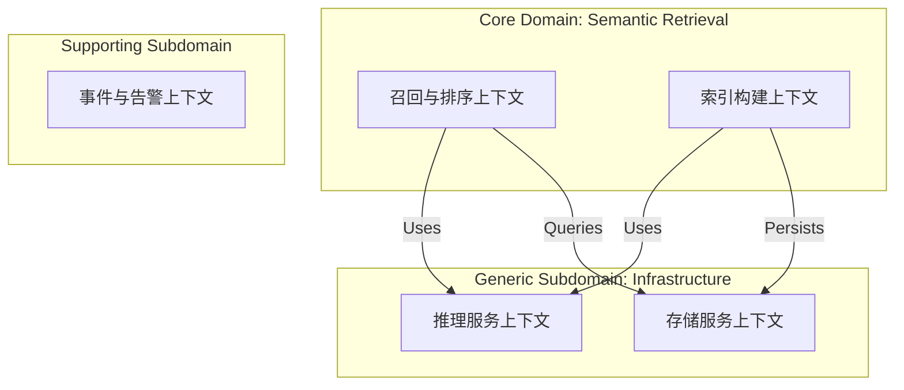

# Edge-Detective 下一代系统架构设计白皮书 (v2.0)

> **文档性质**: 核心架构决策记录 (ADR) 与系统蓝图  
> **设计方法论**: 领域驱动设计 (DDD) + 整洁架构 (Clean Architecture) + 云原生 (Cloud Native)  
> **目标读者**: 系统架构师、高级研发工程师、技术决策者  

---

## 1. 序言：工程设计哲学 (Design Philosophy)

在迈向工业化的过程中，Edge-Detective 面临的核心挑战不再是算法的准确率（这是算法科学家的工作），而是**系统复杂度的熵增**。为了对抗这种熵增，我们确立以下核心设计哲学：

### 1.1 异构计算的物理隔离 (Physical Separation of Heterogeneous Compute)

**现状问题**：当前的单体架构中，Python 业务逻辑（CPU 密集型/IO 密集型）与模型推理（GPU 密集型）运行在同一进程空间。这导致了 GIL 锁争抢、显存碎片化以及无法独立扩缩容。

**设计原则**：**将“思考”（逻辑）与“计算”（推理）彻底剥离。**

*   **业务逻辑层**：必须是**无状态 (Stateless)** 的。它应该像水一样流动，可以在任意 CPU 节点上水平扩展。它只负责编排、决策和分发。
*   **计算能力层**：必须是**服务化 (Service-Oriented)** 的。GPU 资源是昂贵的，它应该作为一个独立的“算力池”存在，通过网络协议暴露能力。

### 1.2 依赖倒置与端口适配器 (DIP & Ports and Adapters)

我们不应该让高层的业务策略依赖于底层的技术实现细节。
*   **错误示范**：`RecallService` 直接 `import vLLM`。这意味着每次更换模型库，都要修改业务代码。
*   **正确姿势**：`RecallService` 依赖于一个抽象接口 `InferencePort`。
    *   **Adapter A**: `VllmAdapter` (适配 vLLM)
    *   **Adapter B**: `LlamaCppAdapter` (适配量化模型)
    *   **Adapter C**: `CloudApiAdapter` (适配 GPT-4)

### 1.3 领域模型的纯净性 (Domain Purity)

**反腐败层 (Anti-Corruption Layer, ACL)** 是必须存在的。外部模型（VLM）输出的是混乱的自然语言或特定格式的 JSON，这些是“脏数据”。我们绝不能让这些脏数据直接渗透到核心业务逻辑中。必须有一层转换层，将其清洗为系统内部稳定的**值对象 (Value Objects)**。

---

## 2. 核心架构视图 (Core Architecture Views)

### 2.1 顶层上下文映射 (Context Map)

我们将系统划分为三个核心限界上下文 (Bounded Context)：



### 2.2 逻辑分层架构 (Logical Layering)

遵循整洁架构原则，由内向外：

1.  **Entities (领域实体)**: `Track`, `Video`, `Trajectory`, `EvidencePackage`。这些对象包含核心业务规则（例如：一个轨迹的时长不能为负，速度不能超光速）。
2.  **Use Cases (应用案例)**: `IndexVideo`, `SearchTracks`, `GenerateReport`。这些负责编排实体。
3.  **Interface Adapters (接口适配)**: `RecallController` (FastAPI), `VlmClient` (Gateway 实现)。
4.  **Frameworks & Drivers**: `PostgreSQL`, `Qdrant`, `vLLM Server`, `Redis`.

---

## 3. 关键技术实现策略

### 3.1 万能推理网关 (Universal Inference Gateway)

这是本架构的核心枢纽，也是解决您关心的**量化模型 (Quantized Model)** 切换问题的关键点。

**设计目标**：业务层完全无感知模型是 FP16 还是 INT4，是跑在 L4 上还是 Jetson 上。

**代码级抽象 (Python Protocol)**:

```python
class InferencePort(Protocol):
    async def chat_completion(self, prompt: str, images: List[Image]) -> InferenceResult:
        ...

class ModelRegistry:
    def get_adapter(self, task_priority: str) -> InferencePort:
        # 策略模式路由
        if task_priority == "HIGH_ACCURACY":
            return VllmAdapter(endpoint="http://gpu-cluster:8000")
        elif task_priority == "LOW_LATENCY":
            return TensorRTAdapter(endpoint="http://local-accelerator:8001")
        elif task_priority == "EDGE_COST_SAVING":
            # 这里就是量化模型的切入点
            return LlamaCppAdapter(model_path="./models/qwen-int4.gguf")
```

**量化模型的集成**：
在工业化场景中，量化模型通常意味着牺牲少量精度换取极致的速度或成本。在我们的架构中，它只是 `InferencePort` 的另一种实现（Adapter）。我们可以在运行时通过**配置中心 (Config Center)** 动态切换适配器，甚至实现 **A/B 测试**（50% 流量走 vLLM，50% 流量走 INT4 量化，对比效果）。

### 3.2 CQRS (命令查询职责分离) 的应用

视频语义检索系统具有极端的读写不对称性：
*   **Write (Index)**: 极重。一小时视频可能产生数万个 Embedding 和元数据。写操作是吞吐量敏感的。
*   **Read (Search)**: 极快。用户希望在毫秒级得到结果。读操作是延迟敏感的。

**架构拆分**：
1.  **Command Side (索引端)**:
    *   采用 **Pipeline 模式**。
    *   Video -> Decode -> Detect -> Crop -> Embed -> VectorDB。
    *   使用 **Celery/Kafka** 削峰填谷。
    *   优化目标：最大化 Batch Size，最大化 GPU 利用率（Throughput）。
2.  **Query Side (检索端)**:
    *   采用 **Scatter-Gather 模式**。
    *   Query -> Vector Search (Top-K) -> Rerank (VLM) -> Response。
    *   优化目标：最小化 Latency。

### 3.3 遗留系统迁移策略 (The Strangler Fig Pattern)

面对现有的 `vlm_client_hf.py` 等遗留代码，我们不建议“大爆炸”式的重写，而是采用 **绞杀植物模式 (Strangler Fig Pattern)**。

1.  **第一步：建立新接口**。定义好完美的 `InferencePort` 接口。
2.  **第二步：适配旧代码**。编写一个 `LegacyHfAdapter`，内部暂时调用旧的 `vlm_client_hf.py` 逻辑。此时业务层已经切换到了新接口，但底层还是旧的。
3.  **第三步：并行建设**。在旁边搭建 vLLM 服务，并编写 `VllmAdapter`。
4.  **第四步：流量切换**。通过配置开关，将 10% 的流量切到 `VllmAdapter`，观察稳定性。
5.  **第五步：扼杀**。当 100% 流量切换完成且稳定后，删除 `vlm_client_hf.py` 和 `LegacyHfAdapter`。

---

## 4. 数据架构与流转 (Data Flow Architecture)

### 4.1 数据分级存储策略 (Tiered Storage)

*   **Hot (L1)**: Redis。存储实时的任务状态、最近的热门检索结果、WebSocket 的会话状态。
*   **Warm (L2)**: Qdrant (Vector DB)。存储 Embedding 向量和轻量级的 payload (Track ID, Time)。这部分数据必须常驻内存或 NVMe SSD。
*   **Cold (L3)**: MinIO (Object Storage) + PostgreSQL。
    *   MinIO 存储所有的非结构化数据：原始视频、轨迹截图 (Crops)、Debug 视频片段。
    *   PostgreSQL 存储结构化元数据：视频信息、轨迹详情、用户审计日志。

### 4.2 反腐败层的数据清洗 (Data Cleansing at ACL)

VLM 返回的自然语言结果（例如 "Yes, I see a man in red."）属于**脏数据**。
ACL 层必须负责：
1.  **Parsing**: 正则提取核心判断（Match: Yes/No）。
2.  **Validation**: 验证置信度是否达标。
3.  **Normalization**: 归一化为标准的系统状态码（Enum: `MATCH_CONFIRMED`, `MATCH_REJECTED`, `AMBIGUOUS`）。

---

## 5. 部署与运维视图 (Deployment & Ops)

### 5.1 容器化编排 (K8s Manifests)

*   **Pod A (API)**: CPU 节点。运行 FastAPI 业务逻辑。可配置 HPA (Horizontal Pod Autoscaler) 根据 CPU 使用率自动扩缩容。
*   **Pod B (Inference-VLLM)**: GPU 节点 (L4)。运行 vLLM Server。独占 GPU。
*   **Pod C (Inference-Quantized)**: CPU 节点或边缘设备。运行 llama.cpp Server。

### 5.2 可观测性 (Observability)

在分布式架构中，日志和链路追踪是生命线。
*   **Tracing**: 集成 OpenTelemetry。每一个 HTTP 请求生成一个 `TraceID`，贯穿 API -> Logic -> VLM -> DB 的全过程。
*   **Metrics**: Prometheus 监控指标。
    *   业务指标：`search_qps`, `index_latency_p99`.
    *   技术指标：`gpu_utilization`, `vlm_queue_length`, `vlm_token_throughput`.

---

## 6. 总结

本白皮书不仅仅是一份技术升级指南，更是一份**系统治理的宣言**。
通过引入 **异构计算分离**，我们解除了 Python 与 GPU 的强耦合；
通过 **端口适配器模式**，我们为未来引入量化模型、云端大模型预留了标准插槽；
通过 **CQRS**，我们平衡了高吞吐索引与低延迟检索的矛盾。

这是一套能够支撑 Edge-Detective 从实验室原型走向大规模工业部署的坚实基石。
